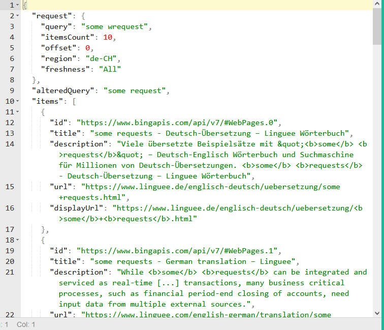

# Swisscows

Clicking search makes some HEAD, OPTIONS, GET requests:  
HEAD https://swisscows.com/_next/data/cW_SbMyHn51vQiG0qo8e9/en/web.json?query=cars on sale  
OPTIONS https://api.swisscows.com/web/search?query=cars+on+sale&offset=0&itemsCount=10&region=de-CH&freshness=All  
GET https://api.swisscows.com/web/search?query=cars+on+sale&offset=0&itemsCount=10&region=de-CH&freshness=All

We can use:
https://swisscows.com/en/web?query=\<query\>&offset=\<(page-1) * 10>

Or we can directly call the API:  
https://api.swisscows.com/web/search?query=some+wrequest&offset=0&itemsCount=10&region=de-CH&freshness=All
Response:

To use the API you have to pass these two headers:

Converting the complicated JS to Golang is hard, so we just run a JS parser in `dontaskjustenjoy.go`.